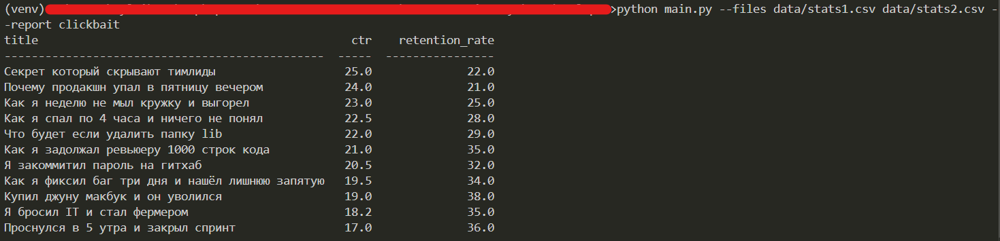
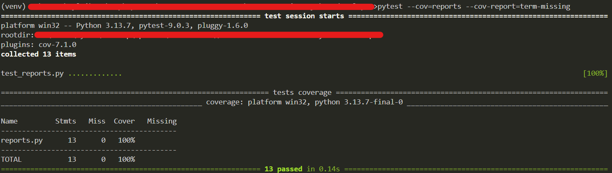

# YouTube Metrics Reporter

CLI-приложение для анализа метрик YouTube-видео из CSV-файлов.

## Установка зависимостей
Для работы приложения
```bach
pip install -r requirements.txt
```

Разработка и тесты
```bach
pip install -r requirements-dev.txt
```

## Запуск

```bash
python main.py --files data/stats1.csv data/stats2.csv --report clickbait
```

## После запуска в терминале


## Тесты

```bash
pytest --cov=reports --cov-report=term-missing
```
## После запуска в терминале


## Добавление нового отчёта

1. Реализуйте функцию в `reports.py` с сигнатурой `(rows: list[dict]) -> list[dict]`
2. Зарегистрируйте её в словаре `REPORTS`

```python
def my_report(rows):
    ...

REPORTS = {
    "clickbait": clickbait_report,
    "my_report": my_report,
}
```

## Линтер

```bash
ruff check main.py reports.py
```